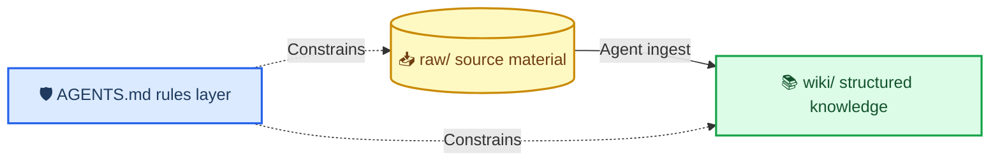

# karp-wiki

_A GitHub Template containing a project-scoped skill that uses Claude Code or Codex to turn source material into a verifiable, queryable local knowledge base._

[中文](README.md)

---

## 📋 Positioning and attribution

This is a GitHub Template for creating a new knowledge-base project with **Use this template**. It is not presented as a general-purpose skill that can be installed into any arbitrary existing repository.

This project was inspired by Andrej Karpathy's Gist published on 2026-04-04.[^1] Inspired by, not affiliated with or endorsed by Andrej Karpathy. This is an independent implementation of the abstract pattern.

## 🚀 Quick start

1. On GitHub, click **Use this template** and create your own private repository. This is safer than cloning the template and accidentally keeping the template repository as `origin`.
2. Install and sign in to Claude Code or Codex. This step is not included in the timing below.
3. Start the Agent in the new repository and say “Help me set up a knowledge base.” You can also invoke `/kb-setup` explicitly in Claude Code or `$kb-setup` in Codex.

> 📌 **Timing:** With the Agent already installed and signed in, allow about 10 minutes to complete the first ingest.

Whether a natural-language request automatically triggers the skill depends on the Agent's discovery and invocation behavior. If it does not trigger, use the explicit command above. This project does not promise a 60-second setup or guarantee automatic invocation.

## 🔗 Discovery in Claude Code and Codex

| Agent | Discovery entry | Explicit invocation |
| --- | --- | --- |
| Claude Code | [`.claude/skills/kb-setup/`](.claude/skills/kb-setup/) | `/kb-setup` |
| Codex | [`.agents/skills/kb-setup/`](.agents/skills/kb-setup/) | `$kb-setup` |

Both discovery entries are generated from the canonical source at [`skills/kb-setup/`](skills/kb-setup/) by `npm run sync-skills`. CI uses `npm run sync-skills:check` to verify that all three copies match. Do not edit the two discovery mirrors directly.

## 🏗️ Three-layer architecture and principles

1. `raw/` is the append-only, untrusted source layer. The Agent does not rewrite or delete existing bytes.
2. `wiki/` is the Agent-maintained structured knowledge layer, using Markdown, YAML frontmatter, and `[[wiki-links]]`.
3. [`AGENTS.md`](AGENTS.md) and the project-scoped skill form the rules layer for setup, ingest, query, lint, privacy, and validation boundaries.

Core principles:

- **Plain Markdown:** Knowledge pages are ordinary files, with no proprietary database dependency.
- **Change AI without losing data:** Data remains in project files, so switching to a compatible Agent or model does not require migrating a proprietary data format.
- **Multimodal input:** Text can be ingested directly; images require real visual capability in the current Agent; in v1, audio is accepted only through user-provided transcripts and there is no built-in ASR.

## 🔐 Privacy and storage modes

Files are stored locally by default; content read by the Agent is sent to the configured model provider.

Before use, read the Claude Code data-usage documentation[^2] and OpenAI's Codex data-controls documentation.[^3] `local-only` describes Git tracking behavior; it does not mean that content read by the Agent never leaves the device. The model-provider boundary above always applies.

Repository-level `storage.mode` in `.karp-wiki/config.json` has three values:

| `storage.mode` | Default | Git tracking behavior |
| --- | --- | --- |
| `local-only` | Yes | `raw/**`, `wiki/**`, and rebuildable data stay out of Git |
| `private-git` | No | After explicit acknowledgement that the remote is private, track `raw/**` and `wiki/**`; rebuildable data remains ignored |
| `public-git` | No | Never track `raw/**`; `wiki/**` may be tracked; rebuildable data remains ignored |

Page-level frontmatter independently sets `content_visibility` to `private` or `shareable`; it cannot be inferred from `storage.mode`. `public-git` has a hard gate: if any page has `content_visibility: private`, `npm run check` exits non-zero and blocks validation.

## 🔧 Deterministic tools and graph contract

These commands require **Node ≥20**:

| Command | Purpose |
| --- | --- |
| `npm run reindex` | Rebuild `wiki/index.md` from knowledge pages |
| `npm run check` | Validate schema, links, raw/hash integrity, index state, and the privacy gate |
| `npm run build-graph` | Generate knowledge-graph data after validation succeeds |

`data/generated/graph.json` is the consumable contract for a v2 visualization and contains `schema_version: 1`, `nodes`, and `edges`. v1 produces data only and has no visualization UI.

## 📍 Directory guide

| Path | Purpose |
| --- | --- |
| [`AGENTS.md`](AGENTS.md) | First-run instructions, daily workflows, and safety boundaries |
| [`examples/`](examples/) | Image and audio-transcript raw inputs plus their derived text knowledge pages; there is no standalone `examples/raw/text/` input |
| [`skills/kb-setup/references/schema.md`](skills/kb-setup/references/schema.md) | Authoritative frontmatter, privacy-tracking, and graph contract |
| [`skills/kb-setup/`](skills/kb-setup/) | Canonical source for `kb-setup` |
| [`raw/`](raw/) | Append-only source material |
| [`wiki/`](wiki/) | Structured knowledge pages, index, and log |
| [`templates/`](templates/) | Templates for the four knowledge-page types |

## 🔗 References

[^1]: Andrej Karpathy. (2026-04-04). GitHub Gist. https://gist.github.com/karpathy/442a6bf555914893e9891c11519de94f

[^2]: Anthropic. “Claude Code data usage.” https://docs.anthropic.com/en/docs/claude-code/data-usage

[^3]: OpenAI. “Using Codex with ChatGPT.” https://help.openai.com/en/articles/11369540-using-codex-with-chatgpt
