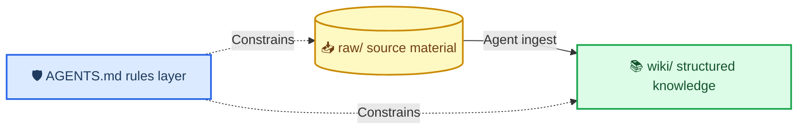

# karp-wiki

_A GitHub Template containing a project-scoped skill that uses Claude Code or Codex to turn source material into a verifiable, queryable local knowledge base._

[中文](README.md)

---

## 📋 Positioning and attribution

This is a GitHub Template for creating a new knowledge-base project with **Use this template**. It is not presented as a general-purpose skill that can be installed into any arbitrary existing repository.

This project was inspired by Andrej Karpathy's Gist published on 2026-04-04.[^1] Inspired by, not affiliated with or endorsed by Andrej Karpathy. This is an independent implementation of the abstract pattern.

## 🚀 Quick start

1. On GitHub, click **Use this template** and create your own private repository. This is safer than cloning the template and accidentally keeping the template repository as `origin`.
2. Install and sign in to Claude Code or Codex. This step is not included in the timing below.
3. Start the Agent in the new repository and say “Help me set up a knowledge base.” You can also invoke `/kb-setup` explicitly in Claude Code or `$kb-setup` in Codex.

> 📌 **Timing:** With the Agent already installed and signed in, allow about 10 minutes to complete the first ingest.

Whether a natural-language request automatically triggers the skill depends on the Agent's discovery and invocation behavior. If it does not trigger, use the explicit command above. This project does not promise a 60-second setup or guarantee automatic invocation.

## 🔗 Discovery in Claude Code and Codex

| Agent | Discovery entry | Explicit invocation |
| --- | --- | --- |
| Claude Code | [`.claude/skills/kb-setup/`](.claude/skills/kb-setup/) | `/kb-setup` |
| Codex | [`.agents/skills/kb-setup/`](.agents/skills/kb-setup/) | `$kb-setup` |

Both discovery entries are generated from the canonical source at [`skills/kb-setup/`](skills/kb-setup/) by `npm run sync-skills`. CI uses `npm run sync-skills:check` to verify that all three copies match. Do not edit the two discovery mirrors directly.

## 🏗️ Three-layer architecture and principles



1. `raw/` is the append-only, untrusted source layer. The Agent does not rewrite or delete existing bytes.
2. `wiki/` is the Agent-maintained structured knowledge layer, using Markdown, YAML frontmatter, and `[[wiki-links]]`.
3. [`AGENTS.md`](AGENTS.md) and the project-scoped skill form the rules layer for setup, ingest, query, lint, privacy, and validation boundaries.

Core principles:

- **Plain Markdown:** Knowledge pages are ordinary files, with no proprietary database dependency.
- **Change AI without losing data:** Data remains in project files, so switching to a compatible Agent or model does not require migrating a proprietary data format.
- **Multimodal input:** Text can be ingested directly; images require real visual capability in the current Agent; in v1, audio is accepted only through user-provided transcripts and there is no built-in ASR.

## 🔐 Privacy and storage modes

Files are stored locally by default; content read by the Agent is sent to the configured model provider.

Before use, read the Claude Code data-usage documentation[^2] and OpenAI's Codex data-controls documentation.[^3] `local-only` describes Git tracking behavior; it does not mean that content read by the Agent never leaves the device. The model-provider boundary above always applies.

Repository-level `storage.mode` in `.karp-wiki/config.json` has three values:

| `storage.mode` | Default | Git tracking behavior |
| --- | --- | --- |
| `local-only` | Yes | `raw/**`, `wiki/**`, and rebuildable data stay out of Git |
| `private-git` | No | After explicit acknowledgement that the remote is private, track `raw/**` and `wiki/**`; rebuildable data remains ignored |
| `public-git` | No | Never track `raw/**`; `wiki/**` may be tracked; rebuildable data remains ignored |

Page-level frontmatter independently sets `content_visibility` to `private` or `shareable`; it cannot be inferred from `storage.mode`. `public-git` has a hard gate: if any page has `content_visibility: private`, `npm run check` exits non-zero and blocks validation.

## 🧰 Machine-aware tool selection

`kb-setup` does not assume that every computer has the same tools. During initialization it inventories both the **capabilities exposed by the Agent in the current session** and the **local machine and installed programs**, including the operating system, CPU architecture, logical cores, memory, and the availability of Node.js, Git, ripgrep, and Obsidian. It then selects the smallest sufficient combination by role and atomically records the inventory and selection in `.karp-wiki/config.json` under `tooling.inventory` and `tooling.selected` for later workflows.

- The deterministic kernel always uses Node.js ≥20 plus `scripts/kb.mjs`; setup blocks and gives installation guidance if it is unavailable.
- Search prefers local `rg`, then the current Agent's file-search capability, then a Node.js filesystem fallback.
- `private-git` and `public-git` select Git; `local-only` may use no version control.
- Image understanding is selected only when the current Agent really has vision capability; v1 audio always uses a user-provided transcript.
- The built-in `karp-web` viewer supports typed-edge and visibility filters; Obsidian Graph View may also be selected when installed, with Markdown and `graph.json` as the minimum fallback.

The Agent shows the proposed selection first. It does not install software without explicit permission or invoke unrelated tools merely because they are available. See [`tool-selection.md`](skills/kb-setup/references/tool-selection.md) for the complete decision rules.

## 🔧 Deterministic tools and graph contract

These commands require **Node ≥20**:

| Command | Purpose |
| --- | --- |
| `npm run reindex` | Rebuild `wiki/index.md` from knowledge pages |
| `npm run check` | Validate schema, links, raw/hash integrity, index state, and the privacy gate |
| `npm run build-graph` | Generate knowledge-graph data after validation succeeds |

`data/generated/graph.json` is the kernel's basic graph contract and contains `schema_version: 1`, `nodes`, and `edges`. The v2a viewer below consumes the richer, shareable-by-default `web/data/kb-data.js`.

## 🕸️ Local web visualization

The following command validates the knowledge base fail-closed before generating `web/data/kb-data.js`:

```bash
npm run build-web
```

Then open [`web/index.html`](web/index.html) directly with `file://`, or run `npm run dev` and visit `http://127.0.0.1:5173/web/`. The development server binds only to the local loopback interface; Python 3 is a convenience server, not a build dependency.

By default, the build writes **only pages with `content_visibility: shareable`** and removes every edge whose endpoint was excluded. Include private pages only for explicit local viewing:

```bash
npm run build-web -- --include-private
```

Never share an output containing private pages; open `web/index.html` directly after generating it. If you still need local HTTP, run `python3 -m http.server 5173 --bind 127.0.0.1` from the repository root. Do not run `npm run dev` again, because it rebuilds with the safe default and excludes private pages. The viewer is zero-dependency and read-only: it has no login, performs no network access, and never writes back to Markdown. It supports title/summary/tag search plus type, tag, visibility, `derived_from`, and `links_to` filters. Unlike Obsidian Graph View, this web viewer distinguishes typed edges directly and excludes private pages during generation instead of merely hiding them in the UI.

## 👁️ View the example in Obsidian

Open `examples/` as a separate Obsidian vault when viewing the finished knowledge graph. Do not use the whole template repository as the example vault; otherwise the root README, `docs/`, skills, and other project Markdown files will also appear in Graph View and obscure the five example knowledge pages. Obsidian's `.obsidian/` directory is local UI state and is ignored at every directory level.

## 📍 Directory guide

| Path | Purpose |
| --- | --- |
| [`AGENTS.md`](AGENTS.md) | First-run instructions, daily workflows, and safety boundaries |
| [`examples/`](examples/) | Image and audio-transcript raw inputs plus their derived text knowledge pages; there is no standalone `examples/raw/text/` input |
| [`skills/kb-setup/references/schema.md`](skills/kb-setup/references/schema.md) | Authoritative frontmatter, privacy-tracking, and graph contract |
| [`skills/kb-setup/`](skills/kb-setup/) | Canonical source for `kb-setup` |
| [`raw/`](raw/) | Append-only source material |
| [`wiki/`](wiki/) | Structured knowledge pages, index, and log |
| [`templates/`](templates/) | Templates for the four knowledge-page types |

## 🔗 References

[^1]: Andrej Karpathy. (2026-04-04). GitHub Gist. https://gist.github.com/karpathy/442a6bf555914893e9891c11519de94f

[^2]: Anthropic. “Claude Code data usage.” https://docs.anthropic.com/en/docs/claude-code/data-usage

[^3]: OpenAI. “Using Codex with ChatGPT.” https://help.openai.com/en/articles/11369540-using-codex-with-chatgpt
